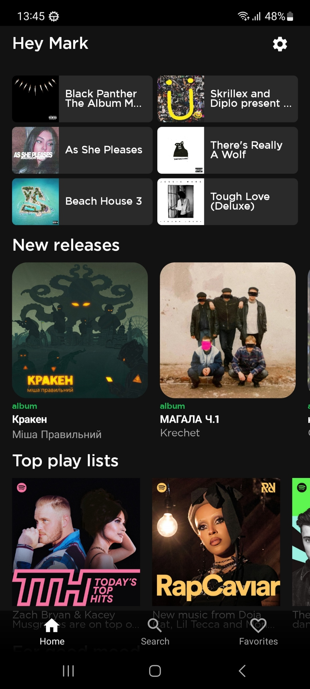

# SpotifyMusicApp

The application was built using the Spotify API, utilizing the official Spotify login library. If you wish to compile the project, you will need to perform the following steps:

1. Create a developer account on Spotify and create your project there.
2. Copy the API keys from your account and write them into the project's root directory in a file named `local.properties` as follows:
   `ClientId = "XXXXXXXX"`
   `ClientSecret = "XXXXXXXX"`
   `RedirectUri = "XXXXXXXX"`
   Also, add the following lines to the `local.properties` file:
   `BASE_URL = "https://api.spotify.com/v1/"`
   `AUTH_URL = "https://accounts.spotify.com/api/token"`
3. Now you are ready to build the project.

## Base project
- **Multi module Architecture**
- **Gradle Kotlin DSL**
- **Dependency injection with Hilt**
- **Paging 3**
- **Kotlin Coroutines**
- **Kotlin StateFlow and SharedFlow**
- **Room**
- **Retrofit**

## Screenshots

</img>
